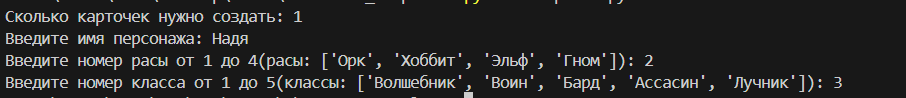
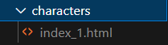
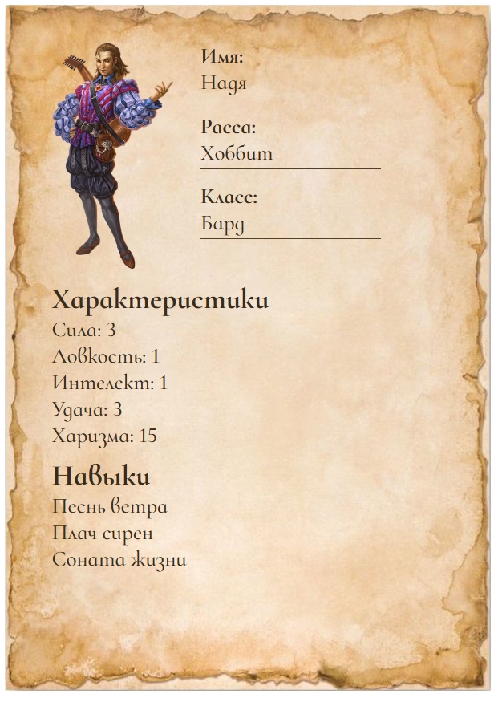

# Создание карточек

## Оглавление

* [Описание проекта](#описание-проекта)
    * [Основные возможности](#основные-возможности)
    * [Предварительные требования](#предварительные-требования)
    * [Установите зависимости](#установите-зависимости)
* [Запуск и использование](#Запуск-и-использование)
    * [Запуск программы](#запуск-программы)
* [Пример вывода](#Пример-вывода)
* [Цель проекта](#цель-проекта)

## Описание проекта

Данный скрипт позволяет создавать карточки персонажей для игр на основе библиотеки `Jinja2`, `random`, `os`.

### Основные возможности

1. С помощью библиотеки `Jinja2` заполняется карточка персонажа. 
2. С помощью библиотеки `random` делает данные ранномными.

### Предварительные требования:

1. Установленный [Python](https://www.python.org/downloads/) версии 3.11 и выше.
2. pip - установщик пакетов Python.

### Установите зависимости

С активированным виртуальным окружением установите зависимости проекта:

```bash
pip install -r requirements.txt
```

## Запуск и использование

### Запуск программы

```
python main.py
```

По итогу у вас запустся программа и если вы введёте нужные вам данные в правильной форме, то у вас в папке `characters` нужное вам количество карточек персонажей.


## Пример вывода







## Цель проекта

Код написан в образовательных целях на онлайн-курсе для веб-разработчиков [dvmn.org](https://dvmn.org/).
